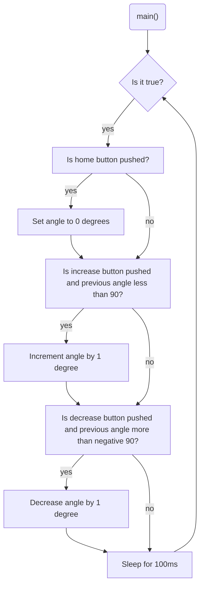

# Program: Servo controller
**Author:** Lydia Calderon-Aceituno
**Date:** December 8, 2021

**Purpose:** Moving a servo with push buttons

## Configuration
Designed for bare metal Mbed OS 6 (enabled through `mbed_app.json`).

## Hardware
### External
* Blue push button connected to p5 (DigitalIn)
* Green push button connected to p6 (DigitalIn)
* Yellow push button connected to p7 (DigitalIn)
* HS-422 HiTEC Servo connected to p21 and right power bus
* Battery pack connected to right power bus and ground 
  

## Flow
